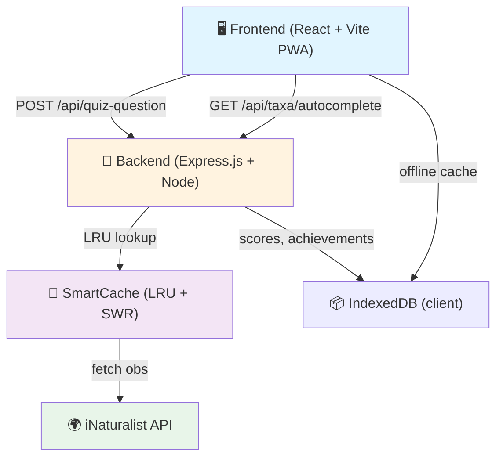

# 🦋 Inaturamouche – Documentation

> **Quiz naturaliste temps réel basé sur la phylogénie et les données iNaturalist.**

Inaturamouche combine l'intelligence artificielle phylogénétique, la PWA offline-first et les données d'observation réelles pour créer une expérience de quiz unique et scientifiquement fondée.

## 📑 Table des matières

- **[Vue d'ensemble](#vue-densemble)** – Vision du projet et features clés
- **[Quick Start](#quick-start)** – Démarrer en 5 min
- **[Structure des guides](#structure-des-guides)** – Navigation dans la documentation
- **[Architecture overview](#architecture-overview)** – Concepts clés
- **[Stack technique](#stack-technique)**

---

## 🎯 Vue d'ensemble

### Pourquoi Inaturamouche ?

**Problème** : Les quizz d'identification botaniques/zoologiques existants sont limités : pas de données réelles, leurres aléatoires peu crédibles, pas de conscience de la phylogénie.

**Solution** :
- 🌍 **Données réelles** : Chaque question provient d'une **observation vérifiée iNaturalist**.
- 🧬 **Phylogénie** : Les leurres sont sélectionnés par **proximité LCA** (Lowest Common Ancestor), créant un vrai défi pédagogique gradué.
- 📱 **Offline-first PWA** : Quiz disponible partout, même sans connexion. Cache intelligent pour photos et métadonnées.
- 🎮 **Modes adaptatifs** : Facile (labels texte + photos) ou Difficile (arbre phylogénétique + structure taxonomique).
- 🌐 **Multilingue** : FR / EN / NL avec parity check automatisé en CI.

### Features clés

| Feature | Détail |
|---------|--------|
| **Pipeline LCA** | Sélection de leurres basée sur distance phylogénétique (near/mid/far) |
| **Cache stratégié** | SmartCache (SWR + LRU) ; photos CacheFirst, quiz NetworkOnly |
| **Anti-répétition** | Cooldown par taxon, historique observations, deck mélangé |
| **Filtres libres** | Packs (mushrooms, trees) ou configurations custom (géo, période, taxa) |
| **Observabilité** | Server-Timing, X-Lure-Buckets, X-Pool-*, debug headers |
| **Achievements** | Système de progression/streaks persisté côté client (IndexedDB) |
| **Offline mode** | Fonctionne sans réseau ; sync des scores à la reconnexion |

---

## ⚡ Quick Start

### 1️⃣ Installation locale

**Prérequis** : Node.js 20+, npm 10+

```bash
# Cloner le repo
git clone https://github.com/user/inaturamouche.git
cd inaturamouche

# Installer dépendances (root + client)
npm install
npm --prefix client install
```

### 2️⃣ Variables d'environnement

Créer un fichier `.env` à la racine :
```env
# Server
PORT=3001
TRUST_PROXY_LIST=loopback,uniquelocal
NODE_ENV=development

# Client (optionnel, défaut : http://localhost:3001 en dev)
VITE_API_URL=http://localhost:3001
```

### 3️⃣ Démarrer en dev (deux terminaux)

**Terminal 1 — Backend** :
```bash
npm run dev
# ✅ API écoute http://localhost:3001
```

**Terminal 2 — Frontend** :
```bash
npm --prefix client run dev
# ✅ Frontend http://localhost:5173 (proxy /api → :3001)
```

### 4️⃣ Build et production

```bash
# Build prod (client dans dist/ → copié dans Docker)
npm run build

# Lancer localement en prod
npm start

# Docker
docker build -t inaturamouche .
docker run -p 3001:3001 inaturamouche
```

### 5️⃣ Tests et vérifications

```bash
# Unit tests (Node + client)
npm test

# Vérifier parité i18n
npm run check:i18n

# Linting frontend
npm --prefix client run lint

# CI complet
npm run ci
```

---

## 📚 Structure des guides

La documentation est organisée en deux dossiers complémentaires :

### 📂 Organisation

- **`/wiki/`** – Guides généraux et tutoriels pour tous les contributeurs
- **`/docs/`** – Documentation technique détaillée pour développeurs et mainteneurs
- **`/client/README.md`** – Documentation spécifique au frontend
- **`/server/README.md`** – Documentation spécifique au backend

➡️ **Index complet** : Voir [docs/README.md](./docs/README.md) pour la navigation complète de la documentation.

### Guides principaux

### 1. **[GETTING_STARTED.md](./wiki/GETTING_STARTED.md)**
Installation détaillée, commandes dev/build, variables d'environnement, premiers pas.

### 2. **[ARCHITECTURE.md](./wiki/ARCHITECTURE.md)** ⭐
Vue d'ensemble unifiée du système avec diagrammes Mermaid :
- Pipeline /api/quiz-question (étapes 1-11)
- State machine GameContext
- Stratégies cache et observabilité

### 3. **[API_REFERENCE.md](./docs/API_REFERENCE.md)**
Contrats des routes : requêtes, réponses, erreurs, exemples cURL.

### 4. **Guides thématiques** (dans `/wiki/guides/`)

#### Backend
- [QUIZ_PIPELINE.md](./wiki/guides/backend/QUIZ_PIPELINE.md) – Détail algorithmique, LCA buckets, anti-répétition
- [CACHE_STRATEGY.md](./wiki/guides/backend/CACHE_STRATEGY.md) – SmartCache, TTL, circuit-breaker, limitations
- [OBSERVABILITY.md](./wiki/guides/backend/OBSERVABILITY.md) – Headers debug, Server-Timing, monitoring

#### Frontend
- [GAME_STATE.md](./wiki/guides/frontend/GAME_STATE.md) – GameContext, lifecycle, AbortController
- [PWA_OFFLINE.md](./wiki/guides/frontend/PWA_OFFLINE.md) – Service Worker, cache policies, offline-first
- COMPONENTS.md – Catalogue des composants réutilisables *(à créer)*
- STYLING.md – Architecture CSS, thèmes, responsive *(à créer)*

#### Ops
- [DEPLOYMENT.md](./wiki/guides/ops/DEPLOYMENT.md) – Docker, Netlify, Render, env vars
- MONITORING.md – Logs Pino, alertes, performance *(à créer)*

### 5. **[CONTRIBUTING.md](./CONTRIBUTING.md)**
Conventions de code, workflow i18n, tests, CI/CD.

---

## 🏗️ Architecture overview



**Points clés** :
1. Le **Frontend** (React 19 + Vite) gère la UI, le PWA offline et l'état du jeu.
2. L'**API** Express décide de la question via LCA, requête iNat et cache.
3. Le **Cache** (SmartCache) réduit les appels iNat et améliore la latence.
4. **IndexedDB** persiste les scores/achievements client et permet l'offline.

---

## 💻 Stack technique

| Couche | Technos |
|--------|---------|
| **Frontend** | React 19, Vite, Vite-PWA, React Router, CSS Modules |
| **Backend** | Node.js (ES modules), Express 5, Zod (validation) |
| **Cache** | LRU (mémoire), SWR (Stale-While-Revalidate) |
| **Logs** | Pino (JSON), Pino-HTTP (middleware) |
| **Tests** | Node built-in test runner, Vitest (client) |
| **i18n** | JSON locales + parity check automatisé |
| **Deployment** | Docker, Netlify (front), Render (API) |
| **Observabilité** | Server-Timing, headers X-*, DevTools |

---

## 🔗 Ressources

- **Prod** :
  - Frontend : https://inaturamouche.netlify.app
  - API : https://inaturamouche-api.onrender.com

- **Données** :
  - iNaturalist : https://www.inaturalist.org
  - Packs locaux : `shared/data/*.json`

- **Communauté** :
  - Issues : GitHub Issues
  - Discussions : GitHub Discussions
  - PR : Bienvenues ! Voir [CONTRIBUTING.md](./CONTRIBUTING.md)

---

## 📝 Notes pour les développeurs

- **Nouvelles features** : Consulter [ARCHITECTURE.md](./wiki/ARCHITECTURE.md) avant de modifier le pipeline.
- **Translations** : Lancer `npm run check:i18n` après chaque changement i18n.
- **Performance** : Les headers `Server-Timing` et `X-Lure-Buckets` aident à diagnostiquer les goulots.
- **Tests** : À ajouter pour tout changement de logique métier ou API.

**Besoin d'aide ?** → Ouvrir une issue ou consulter le guide pertinent dans `/wiki/guides/`.
