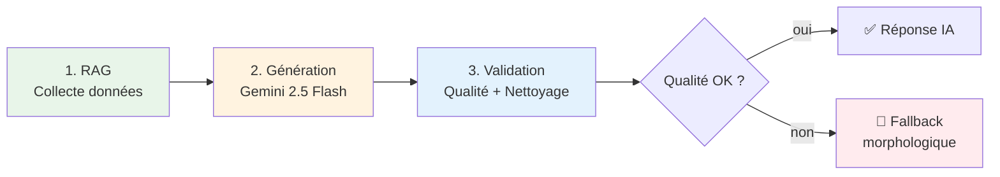
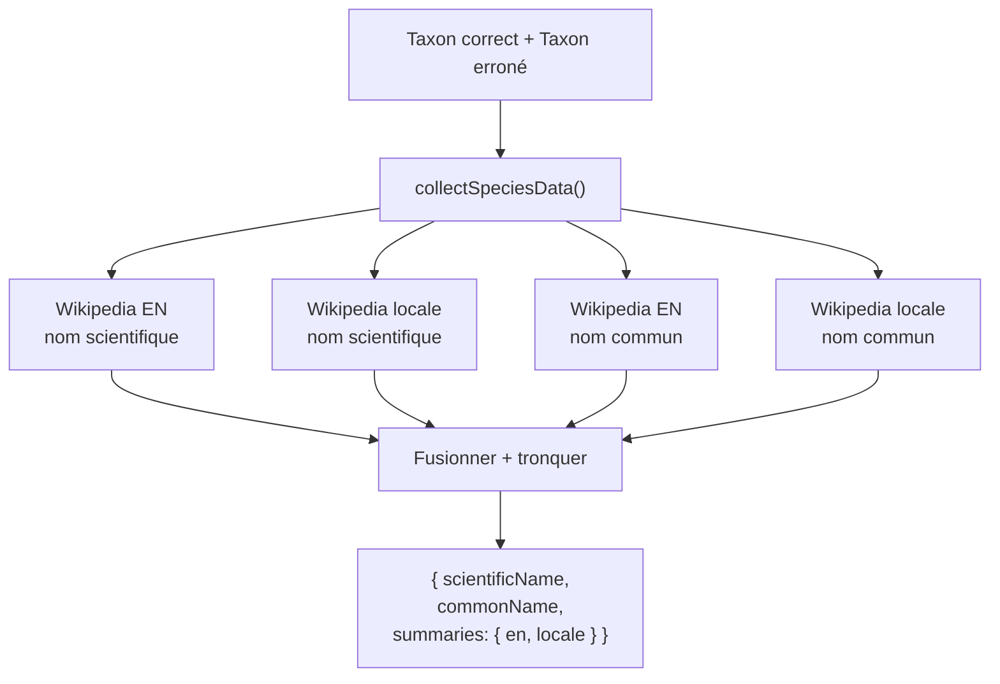
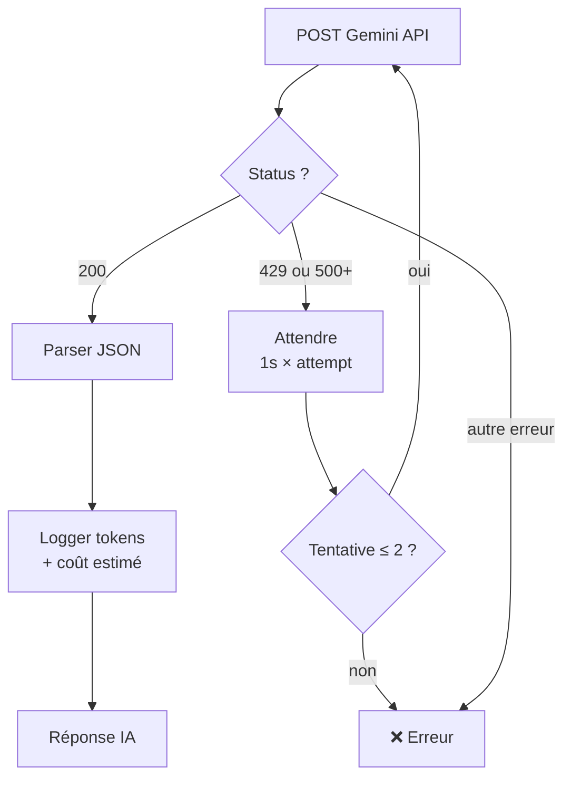
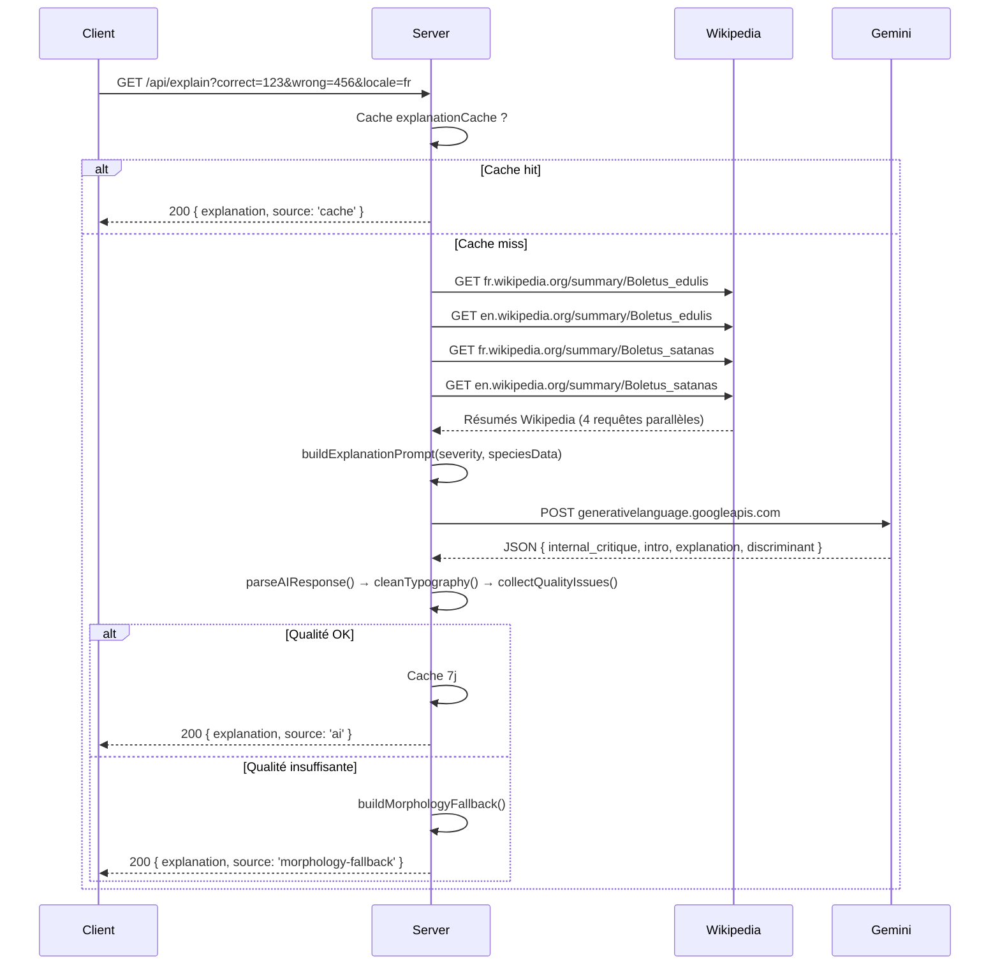

# Système IA — Explications et Devinettes

> Comment Papy Mouche distingue un Bolet de Satan d'un Cèpe de Bordeaux, et pourquoi il ne se trompe (presque) jamais.

## Vue d'ensemble

Le système IA génère deux types de contenu :
- **Explications** (`generateCustomExplanation`) — après une réponse, explique les différences morphologiques entre l'espèce correcte et celle choisie par erreur.
- **Devinettes** (`generateRiddle`) — en mode riddle, fournit 3 indices progressifs pour deviner l'espèce sans voir la photo.

Les deux suivent le même pipeline en 4 étapes :



## Étape 1 — RAG (Retrieval-Augmented Generation)

**Fichier** : `server/services/ai/ragSources.js`

Avant d'appeler l'IA, le système collecte des données factuelles depuis Wikipedia pour ancrer la génération dans la réalité.



### Détails techniques

- **API** : Wikipedia REST v1 (`{lang}.wikipedia.org/api/rest_v1/page/summary/{title}`)
- **Timeout** : 5 secondes par requête (`safeFetch()`)
- **Traitement** : les résumés sont nettoyés (HTML strippé, whitespace normalisé) puis tronqués pour rester dans les limites de tokens
- **Tolérance** : si Wikipedia ne retourne rien, le pipeline continue sans données RAG — l'IA s'appuie alors uniquement sur ses connaissances internes
- **Langues** : la locale du joueur (fr/en/nl) + anglais comme fallback

### Calcul de sévérité

**Fichier** : `server/services/ai/promptBuilder.js`

La distance taxonomique entre les deux espèces détermine le ton de l'explication :

| Sévérité | Condition | Comportement IA |
|----------|-----------|-----------------|
| `CLOSE` | Même genre | Détails fins : couleur, texture, habitat |
| `MEDIUM` | Même famille | Différences structurelles |
| `HUGE` | Classe/règne différent | Évidences grossières, ton rassurant |

## Étape 2 — Génération (Gemini 2.5 Flash)

**Fichier** : `server/services/ai/aiPipeline.js`

### Configuration du modèle

| Paramètre | Explication | Devinette |
|-----------|-------------|-----------|
| Modèle | `gemini-2.5-flash` | `gemini-2.5-flash` |
| Température | 0.4 (factuel) | 0.8 (créatif) |
| Top-P | 0.8 | 0.95 |
| Max tokens | 4000 | 4000 |
| Timeout | 45 s | 45 s |
| Retries | 2 | 2 |

### Persona : Papy Mouche

Le system prompt définit le personnage **Papy Mouche**, un naturaliste pédagogue :

> *Naturaliste enseignant passionné qui tutoie l'utilisateur, cite les espèces par leur nom, et utilise un ton encourageant.*

Contraintes du prompt :
- Explication : **5–200 mots**
- Devinette : **3 indices, max 180 caractères chacun**
- Format de sortie : **JSON strict** avec champ `internal_critique` (auto-évaluation forcée avant la réponse finale)

### Schéma de sortie (Explication)

```json
{
  "internal_critique": "L'explication couvre bien les différences de chapeau...",
  "intro": "Bonne intuition !",
  "explanation": "Le Cèpe de Bordeaux a un chapeau brun-noisette...",
  "discriminant": "Réseau de pores blanc sous le chapeau (vs lames)"
}
```

### Retry avec backoff



### Estimation de coût

Le pipeline calcule un coût estimé après chaque appel :
- Input : **$0.30 / 1M tokens**
- Output : **$2.50 / 1M tokens**

Ce coût est loggé et agrégé dans le dashboard de métriques (voir [metrics-system.md](metrics-system.md)).

## Étape 3 — Validation et nettoyage

**Fichier** : `server/services/ai/outputFilter.js`

La sortie brute de l'IA passe par un pipeline de nettoyage en 3 phases :

### Phase A — Parse et validation structurelle

`parseAIResponse()` extrait le JSON depuis la réponse Gemini, en gérant :
- Réponses wrappées dans des blocs markdown (`` ```json ```)
- Champs manquants (fallback sur valeurs vides)
- JSON invalide (→ fallback)

### Phase B — Nettoyage typographique

`cleanTypography()` corrige :
- Espaces manquants avant la ponctuation française (` !`, ` ?`, ` :`)
- Capitalisation après les points
- Whitespace excessif

### Phase C — Détection de problèmes de qualité

`collectQualityIssues()` cherche 9 catégories de défauts :

| Catégorie | Exemple | Action |
|-----------|---------|--------|
| Lettres répétées | "leeee chapeau" | Signaler |
| Mots dupliqués | "le le champignon" | Signaler |
| Mots cassés | "champ/ignon" | Signaler |
| Ponctuation anormale | "!!!!" | Signaler |
| Bruit de métadonnées | "```json" | Signaler |
| Symboles non-textuels | "★ ▶" | Signaler |
| Séquences suspectes | "aaaa" sans sens | Signaler |
| Troncation | Phrase coupée sans fin | Signaler |
| Comparaison anonyme | "le premier" au lieu du nom | Remplacer |

### Phase D — Normalisation

`normalizeExplanation()` remplace les pronoms vagues par les noms réels des espèces :
- "le premier" → "*Boletus edulis*"
- "the first species" → "*Boletus satanas*"

## Étape 4 — Fallback morphologique

Si l'IA échoue (erreur réseau, qualité insuffisante, timeout), le système génère un **fallback déterministe** :

**`buildMorphologyFallback()`** sélectionne un conseil prédéfini basé sur le groupe iconique du taxon :

| Groupe iconique | Conseil type |
|----------------|--------------|
| Fungi | "Observe la forme du chapeau, les lamelles ou tubes sous le chapeau..." |
| Aves | "Regarde la taille, la forme du bec, les couleurs du plumage..." |
| Insecta | "Compte les pattes, observe les antennes, les ailes..." |
| Plantae | "Examine la forme des feuilles, la disposition des pétales..." |
| Mammalia | "Observe la taille, la forme des oreilles, le pelage..." |

Le fallback est marqué `source: 'morphology-fallback'` pour le distinguer dans les métriques.

## Cache IA

Les résultats sont mis en cache de manière agressive pour éviter les appels répétés (et les coûts) :

| Cache | TTL | Stale | Max entries |
|-------|-----|-------|-------------|
| `explanationCache` | 7 jours | 30 jours | 1 000 |
| `riddleCache` | 7 jours | 30 jours | 1 000 |

La clé de cache combine le taxon correct, le taxon erroné, et la locale. Deux joueurs posant la même question dans la même langue reçoivent la même explication.

## Flux complet — Diagramme de séquence



---

*Fichiers clés : [server/services/ai/aiPipeline.js](../../server/services/ai/aiPipeline.js), [server/services/ai/aiConfig.js](../../server/services/ai/aiConfig.js), [server/services/ai/ragSources.js](../../server/services/ai/ragSources.js), [server/services/ai/promptBuilder.js](../../server/services/ai/promptBuilder.js), [server/services/ai/outputFilter.js](../../server/services/ai/outputFilter.js)*
