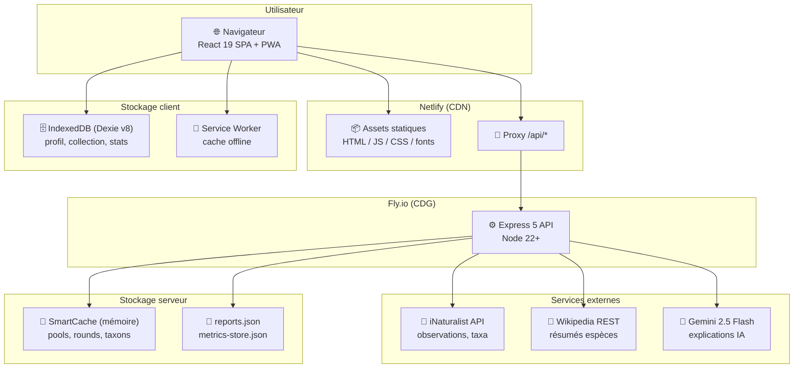
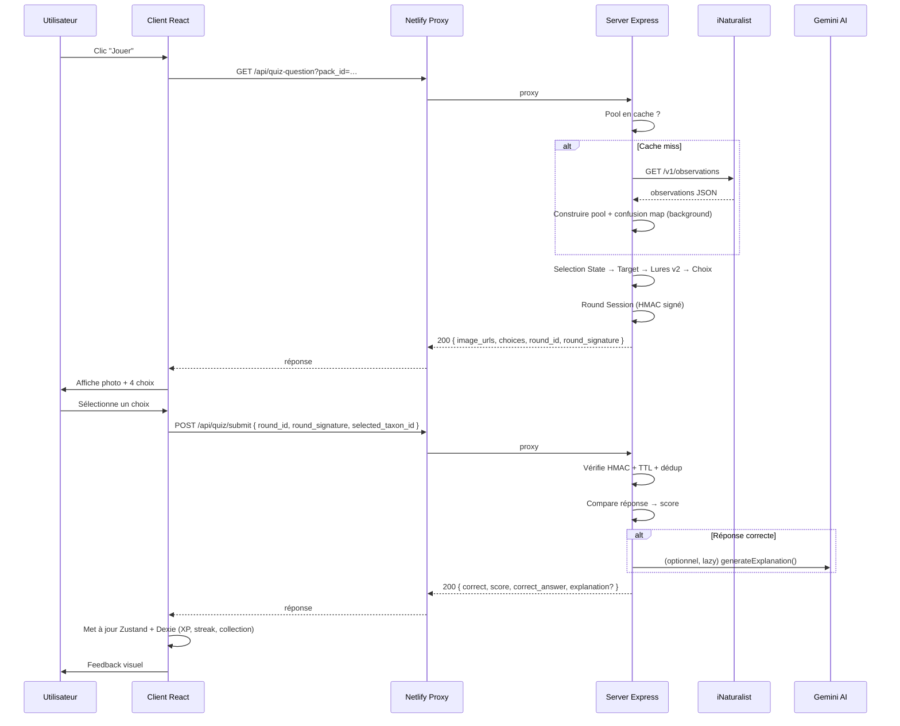

# Architecture d'ensemble

> Pourquoi le système est découpé ainsi, et comment les pièces s'emboîtent.

## Vue d'ensemble

iNaturaQuizz est un **monorepo** organisé en 4 couches :

```
client/          → SPA React 19 + PWA (Vite 5)
server/          → API REST Express 5 (Node 22+)
shared/          → Code partagé (scoring.js)
lib/             → Utilitaires Node-only (SmartCache, quiz-utils)
```

Le frontend est déployé sur **Netlify** (CDN mondial), l'API sur **Fly.io** (région CDG, Paris). Netlify proxifie `/api/*` vers Fly.io, ce qui masque le backend au navigateur et évite tout problème CORS en production.

## Diagramme C4 — Conteneurs



## Pourquoi ce découpage

### Monorepo, pas de microservices

Un seul dépôt, un seul `package.json` racine avec workspaces implicites. Raisons :

1. **Équipe réduite** — un développeur principal, pas besoin de coordination inter-repo.
2. **Partage de code** — `shared/scoring.js` est importé côté client ET serveur pour garantir que le calcul de score est identique.
3. **Déploiement atomique** — un `git push` déploie front + back. Pas de risque de version mismatch.

### Séparation Netlify / Fly.io

| Aspect | Netlify (front) | Fly.io (back) |
|--------|-----------------|----------------|
| Contenu | Fichiers statiques | API dynamique |
| Scaling | CDN mondial auto | 1 instance, 256 MB |
| Coût | Free tier | Free tier |
| Cold start | Aucun | ~2s (conteneur Docker) |

Le proxy Netlify (`/api/* → https://inaturamouche.fly.dev/api/:splat`) évite d'exposer l'URL Fly.io et supprime les requêtes CORS preflight.

### Pas de base de données

Le serveur n'a **aucune base de données**. Tout l'état serveur vit en mémoire (SmartCache) ou dans deux fichiers JSON sur disque (`reports.json`, `metrics-store.json`). Raison : le budget mémoire de 256 MB sur Fly.io suffit pour ~1000 rounds actifs et ~500 pools d'observations cache simultanés.

Le profil utilisateur est stocké **côté client uniquement** dans IndexedDB via Dexie v8. Il n'y a pas de système d'authentification.

## Flux réseau principal



## Stack technique — Justification des choix

| Choix | Raison |
|-------|--------|
| **React 19** | Concurrent features (Suspense, transitions) pour le chargement fluide des images |
| **Vite 5** | HMR instantané, tree-shaking agressif, chunks optimisés (~150 KB gzip total) |
| **Express 5** | Async error handling natif (plus besoin de `express-async-errors`) |
| **Zustand** | 3 slices (XP, Streak, Achievements) dans un seul store — remplace 3 React Contexts   |
| **Dexie v8** | IndexedDB avec API Promise, migrations automatiques (v3→v8), utilisé sans serveur |
| **Pino** | Logger JSON structuré, faible overhead, compatible Fly.io logs |
| **Zod** | Validation stricte des entrées API (`z.enum` pour game_mode, round_action, events) |
| **SmartCache** | Cache mémoire custom avec stale-while-revalidate + request coalescing + circuit breaker |
| **HMAC-SHA256** | Signature des rounds sans session/cookie, stateless, timing-safe |

## Invariants architecturaux

1. **Pas d'auth, pas de session** — le `clientId` est un UUID généré côté client et stocké dans IndexedDB. Il n'identifie pas un "utilisateur" mais un "navigateur".
2. **Source of truth côté client** — le profil (XP, niveau, streak, collection) vit dans IndexedDB. Le serveur ne connaît pas le profil.
3. **Scoring identique** — `shared/scoring.js` est importé des deux côtés pour éviter toute divergence de calcul.
4. **Stateless API** — chaque requête porte toute l'information nécessaire (round_id + signature). Le serveur peut redémarrer sans perdre de données critiques (les rounds actifs expirent naturellement).
5. **Degraded mode** — si iNaturalist est indisponible, le serveur sert un pool dégradé reconstruit depuis le cache existant, en dernier recours un pool cross-pack.

---

*Fichiers clés : [server/app.js](../../server/app.js), [client/src/App.jsx](../../client/src/App.jsx), [shared/scoring.js](../../shared/scoring.js)*
