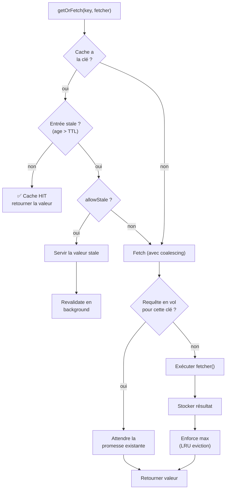
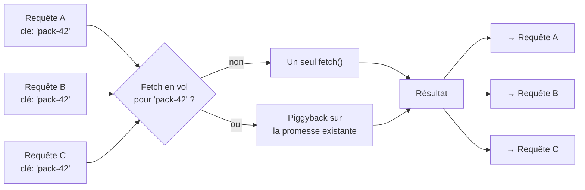
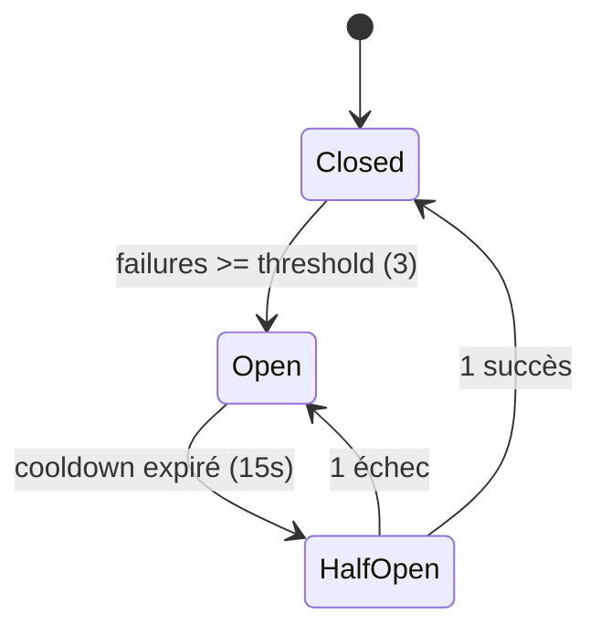
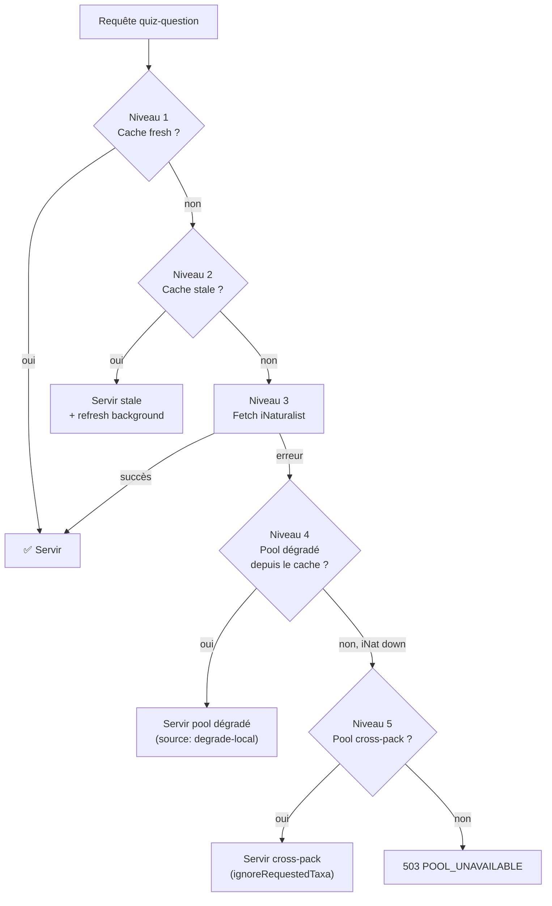

# Stratégie de cache

> Comment servir des questions en 20 ms avec 256 MB de RAM et zéro base de données.

## Le défi

Le serveur Fly.io dispose de **256 MB de RAM** et doit :
- Appeler l'API iNaturalist (~300 ms par page)
- Stocker des pools de centaines d'observations
- Gérer ~1000 rounds actifs simultanément
- Mettre en cache les résultats IA (coûteux en tokens)

La réponse : **SmartCache**, un cache mémoire custom avec 4 caractéristiques clés.

## SmartCache — Architecture

**Fichier** : `lib/smart-cache.js`



### Constructeur

```javascript
new SmartCache({
  maxSize,        // nombre max d'entrées
  ttlMs,          // durée de fraîcheur (ms)
  staleTtlMs,     // durée max de stale-while-revalidate (ms)
  name,           // nom pour le logging
})
```

### Les 4 caractéristiques

#### 1. TTL + Stale-while-revalidate

Inspiré du pattern HTTP `Cache-Control: stale-while-revalidate`. Chaque entrée a deux horizons temporels :

```
├──── TTL ────┤
├──────── Stale TTL ──────────┤
│   Fresh     │    Stale      │  Expired
│  (servir)   │ (servir +     │  (refetch)
│             │  revalider    │
│             │  en fond)     │
```

- **Fresh** (age < TTL) : servie directement, aucun fetch.
- **Stale** (TTL < age < staleTTL) : servie immédiatement au client, un refresh est lancé **en arrière-plan** pour la prochaine requête.
- **Expired** (age > staleTTL) : supprimée, fetch obligatoire.

#### 2. Request Coalescing (anti-stampede)



Quand 3 requêtes demandent la même clé simultanément, **un seul fetch** est exécuté. Les 2 autres requêtes attendent la même promesse. Cela évite le **cache stampede** (thundering herd) après l'expiration d'une entrée populaire.

Implémentation : une `Map<key, Promise>` (`_inFlight`) stocke les promesses en cours. Le fetch est wrappé dans `_fetchWithCoalescing()` qui vérifie `_inFlight` avant de lancer un nouveau fetch.

#### 3. LRU Eviction

Quand le cache atteint `maxSize`, l'entrée la plus ancienne (première dans la `Map`, grâce à l'ordre d'insertion ES2015) est supprimée. C'est un LRU approximatif — un `get()` ne réordonne pas l'entrée, mais un `set()` la place en fin de Map.

```javascript
_enforceMax() {
  while (this._store.size > this._maxSize) {
    const oldest = this._store.keys().next().value;
    this._store.delete(oldest);
  }
}
```

#### 4. Background Revalidation

`_revalidate()` lance le fetcher en arrière-plan et met à jour le cache silencieusement. Si le fetch échoue, l'ancienne entrée stale est conservée. L'erreur est logguée mais jamais propagée au client.

## Circuit Breaker

**Fichier** : `lib/smart-cache.js`

Le circuit breaker protège le serveur contre les cascades d'erreurs quand un service externe (iNaturalist) est en panne.



### Configuration

| Paramètre | Défaut | Description |
|-----------|--------|-------------|
| `failureThreshold` | 3 | Erreurs consécutives avant ouverture |
| `cooldownMs` | 15 000 | Durée en état "open" avant de tenter |
| `halfOpenMax` | 1 | Nombre de tentatives en half-open |

### États

| État | Comportement |
|------|-------------|
| **Closed** | Toutes les requêtes passent. Compteur d'échecs actif. |
| **Open** | `canRequest()` retourne `false`. Aucune requête ne passe. Code lancé : `circuit_open`. |
| **Half-Open** | 1 seule requête passe (test). Succès → Closed. Échec → Open. |

## Instances de cache dans l'application

| Instance | Localisation | Max | TTL | Stale TTL | Usage |
|----------|-------------|-----|-----|-----------|-------|
| `questionCache` | `server/cache/questionCache.js` | configurable | configurable | configurable | Pools d'observations |
| `taxonDetailsCache` | `server/cache/` | configurable | configurable | configurable | Détails enrichis des taxons |
| `roundCache` | `server/services/roundStore.js` | 1000+ | `ROUND_STATE_TTL_MS` | — | Rounds actifs |
| `submissionDedupCache` | `server/services/roundStore.js` | — | — | — | Anti double-submit |
| `selectionStateCache` | `server/cache/selectionCache.js` | configurable | configurable | configurable | État de sélection par client |
| `explanationCache` | `server/services/ai/aiPipeline.js` | 1 000 | 7 jours | 30 jours | Explications IA |
| `riddleCache` | `server/services/ai/aiPipeline.js` | 1 000 | 7 jours | 30 jours | Devinettes IA |
| `confusionMapCache` | `server/services/confusionMap.js` | — | — | — | Confusion maps par pool |

## Pattern de dégradation gracieuse

Le cache participe à la stratégie de résilience du serveur à 3 niveaux :



### Pool dégradé

Quand iNaturalist est indisponible, `buildDegradePoolFromCache()` reconstruit un pool à partir des observations déjà en cache dans d'autres entrées de `questionCache`. Contraintes :
- Max `degradePoolMaxTaxa` taxons
- Max `degradePoolMaxObsPerTaxon` observations par taxon
- La confusion map n'est pas disponible → leurres en mode LCA-only

### Pool cross-pack

En dernier recours (circuit breaker ouvert), le serveur ignore même les taxons demandés et construit un pool à partir de **n'importe quel** pool en cache. Le joueur peut voir des espèces hors de son pack, mais le jeu continue.

## Gestion mémoire

Avec 256 MB sur Fly.io, la mémoire est la ressource critique. Chaque pool peut peser ~500 KB (300 observations × 1.5 KB par observation sanitisée). Avec un max de ~100 pools en cache, cela représente ~50 MB. Les rounds (~2 KB chacun, max 1000) ajoutent ~2 MB. Le reste est disponible pour Node.js, le code, et les caches secondaires.

Le LRU eviction du SmartCache garantit que la mémoire ne croît pas indéfiniment — les pools les moins récemment accédés sont évincés en premier.

---

*Fichier clé : [lib/smart-cache.js](../../lib/smart-cache.js)*
