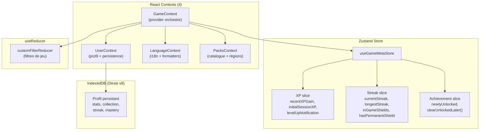
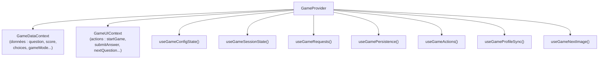
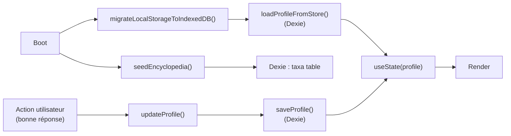
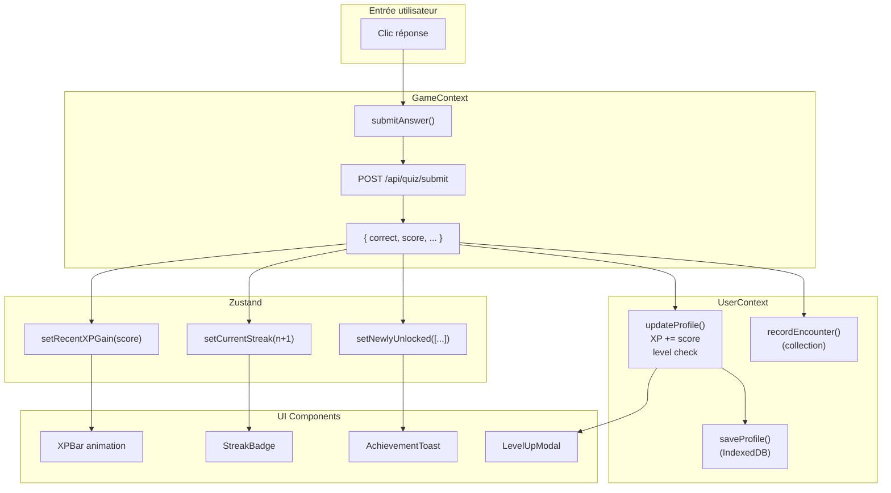

# État frontend

> Comment 3 couches de state management cohabitent sans se marcher dessus.

## Vue d'ensemble

Le frontend utilise **3 mécanismes de gestion d'état** complémentaires, chacun optimisé pour un cas d'usage :



## Pourquoi 3 mécanismes

| Mécanisme | Quand l'utiliser | Force |
|-----------|------------------|-------|
| **Zustand** | État transient de session (XP en cours, streak, achievements) | Pas de re-render de l'arbre entier, sélecteurs granulaires |
| **React Context** | Données partagées dans tout l'arbre (profil, langue, packs) | Injection de dépendances, composition de providers |
| **useReducer** | Machine à états avec transitions explicites (filtres) | Actions typées, prévisible, testable |

### Pourquoi pas tout en Zustand ?

Les Contexts existaient avant l'introduction de Zustand. La migration a été **partielle et ciblée** : seuls les 3 anciens contextes (XPContext, StreakContext, AchievementContext) ont été fusionnés en un Zustand store unique (`useGameMetaStore`). Les 4 contextes restants (Game, User, Language, Packs) conservent leur structure car ils gèrent des effets secondaires complexes (fetch API, persistence IndexedDB, chargement paresseux de locales).

## Zustand — `useGameMetaStore`

**Fichier** : `client/src/state/gameMetaStore.js`

Un seul store avec 3 slices combinées :

### XP Slice

```javascript
{
  recentXPGain: 0,          // XP gagné dans la dernière réponse
  initialSessionXP: 0,       // XP au début de la session (pour calcul de progression)
  levelUpNotification: null,  // { level, previousLevel } pour déclencher l'animation
}
```

### Streak Slice

```javascript
{
  currentStreak: 0,          // Bonnes réponses consécutives dans la session
  longestStreak: 0,          // Record de la session
  inGameShields: 0,          // Boucliers disponibles (protègent le streak)
  hasPermanentShield: false, // Bouclier permanent (achievement Titanium Series)
}
```

### Achievement Slice

```javascript
{
  newlyUnlocked: [],     // Achievements débloqués dans la dernière action
  // clearUnlockedLater() : efface newlyUnlocked après 5 secondes
  // clearAchievementsTimer() : annule le timer en cours
}
```

### Usage dans les composants

Les composants utilisent des sélecteurs granulaires pour éviter les re-renders inutiles :

```javascript
// ✅ Ne re-render que si recentXPGain change
const xp = useGameMetaStore((s) => s.recentXPGain);

// ❌ Re-render à chaque changement du store
const store = useGameMetaStore();
```

## React Contexts

### GameContext — Orchestrateur central

**Fichier** : `client/src/context/GameContext.jsx`

Le GameContext est le **hub central** qui compose tous les autres contextes et hooks. Il expose deux sub-contexts pour optimiser les re-renders :



Le split DataContext / UIContext est une **optimisation de performance** : les composants qui n'affichent que des données ne re-render pas quand une action change, et vice-versa.

#### Hooks composés

| Hook | Responsabilité |
|------|---------------|
| `useGameConfigState` | Pack actif, filtres, mode de jeu, seed quotidien |
| `useGameSessionState` | Question courante, score, loading, game over |
| `useGameRequests` | Fetch API, abort, prefetch, queue |
| `useGamePersistence` | Sauvegarde/reprise de session (IndexedDB) |
| `useGameActions` | startGame, submitAnswer, nextQuestion, quitGame |
| `useGameProfileSync` | Synchronise le profil UserContext → Zustand |
| `useGameNextImage` | Préchargement de l'image suivante |

### UserContext — Profil et persistence

**Fichier** : `client/src/context/UserContext.jsx`

Gère le cycle de vie du profil utilisateur :



Responsabilités :
- `profile` : XP, niveau, streak quotidien, collection, espèces manquées
- `updateProfile()` : met à jour le profil + persiste dans IndexedDB
- `queueAchievements()` : file d'attente d'achievements à afficher
- `recordEncounter()` : enregistre une observation dans la collection
- `seedEncyclopedia()` : peuple la table `taxa` de Dexie avec les données des packs

### LanguageContext — i18n

**Fichier** : `client/src/context/LanguageContext.jsx`

```javascript
{
  language: 'fr',              // 'fr' | 'en' | 'nl'
  nameFormat: 'vernacular',    // 'vernacular' | 'scientific'
  t: (key) => string,          // traduction avec interpolation
  formatDate: (date) => string,
  formatNumber: (n) => string,
  setLanguage: (lang) => void,
  setNameFormat: (fmt) => void,
}
```

Fonctionnement :
- Les messages français sont **bundlés** (`import fr from '../locales/fr'`)
- L'anglais et le néerlandais sont chargés **paresseusement** (`import('../locales/en')`)
- La langue est détectée automatiquement depuis `navigator.languages` puis persistée dans `localStorage`
- Migration legacy : l'ancien flag `inaturamouche_scientific` (boolean) est migré vers `nameFormat`

### PacksContext — Catalogue de packs

**Fichier** : `client/src/context/PacksContext.jsx`

Gère le chargement et l'organisation des packs de quiz :

```javascript
{
  packs: Pack[],               // catalogue complet (62 packs)
  loading: boolean,
  region: string,              // 'belgium' | 'france' | 'europe' | 'world'
  homeCatalog: HomeCatalog,    // sections: starter, near_you, explore
  recentPackIds: string[],     // 12 derniers packs joués
  setRegion: (r) => void,
  refreshPacks: () => void,
  recordRecentPack: (id) => void,
}
```

Fonctionnement :
- Fetch parallèle : `getPackCatalog()` + `getHomePackCatalog(region)`
- Détection de région automatique via `detectRegion()` (géolocalisation navigateur)
- Override de région persisté dans `localStorage`
- Fallback : si l'API échoue, un catalogue de base est construit depuis les packs chargés (`buildHomeFallback()`)

## useReducer — Filtres custom

**Fichier** : `client/src/state/filterReducer.js`

Les filtres de jeu personnalisé sont gérés par un `useReducer` classique :

```javascript
const initialCustomFilters = {
  taxa_enabled: false,
  includedTaxa: [],
  excludedTaxa: [],
  place_enabled: false,
  geo: { mode: 'place' },
  period_enabled: false,
  d1: '',
  d2: '',
};
```

### Actions

| Action | Effet |
|--------|-------|
| `TOGGLE_TAXA` | Active/désactive le filtre par taxons |
| `ADD_INCLUDED_TAXON` | Ajoute un taxon inclus (dédupliqué par id) |
| `REMOVE_INCLUDED_TAXON` | Supprime un taxon inclus |
| `ADD_EXCLUDED_TAXON` | Ajoute un taxon exclu |
| `REMOVE_EXCLUDED_TAXON` | Supprime un taxon exclu |
| `TOGGLE_PLACE` | Active/désactive le filtre géographique |
| `TOGGLE_PERIOD` | Active/désactive le filtre temporel |
| `SET_GEO` | Définit le mode géo (`{ mode: 'place' }` ou `{ mode: 'coords', ... }`) |
| `SET_FILTER` | Setter générique `{ name, value }` |
| `RESTORE` | Restaure l'état complet (reprise de session) |

## Persistence — Dexie v8 (IndexedDB)

Le profil utilisateur et les données de collection sont persistés dans IndexedDB via Dexie v8. Le schéma a évolué de la version 3 à la version 8 :

```
v3 → v4 : ajout table stats
v4 → v5 : ajout table taxa (encyclopédie)
v5 → v6 : index iconic_taxon_id sur taxa
v6 → v7 : ajout colonnes encounters, mastery sur taxa
v7 → v8 : ajout table sessionBackup
```

### Tables

| Table | Clé primaire | Index | Usage |
|-------|-------------|-------|-------|
| `profile` | `id` | — | Profil joueur (singleton) |
| `stats` | `id` | — | Statistiques de jeu |
| `taxa` | `id` | `iconic_taxon_id` | Encyclopédie (espèces connues) |
| `sessionBackup` | `id` | — | Sauvegarde de session (reprise) |

### Migration localStorage → IndexedDB

Au boot, `migrateLocalStorageToIndexedDB()` vérifie si d'anciennes données existent dans localStorage et les migre vers Dexie. Cette migration est idempotente et ne s'exécute qu'une fois.

## Flux de données complet



---

*Fichiers clés : [client/src/state/gameMetaStore.js](../../client/src/state/gameMetaStore.js), [client/src/context/GameContext.jsx](../../client/src/context/GameContext.jsx), [client/src/context/UserContext.jsx](../../client/src/context/UserContext.jsx), [client/src/state/filterReducer.js](../../client/src/state/filterReducer.js)*
