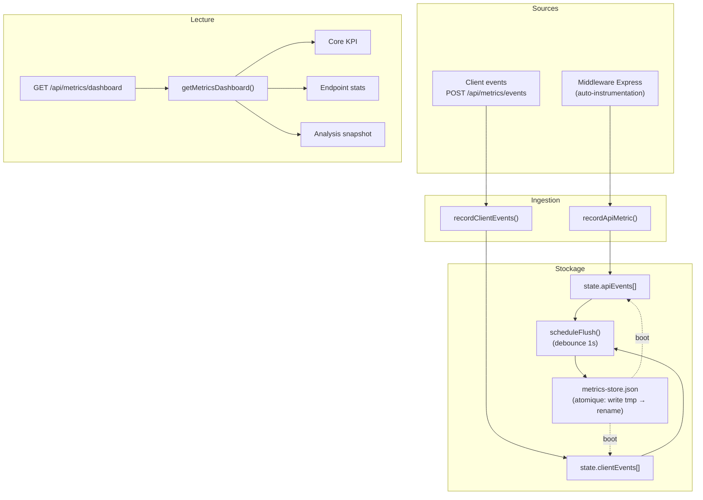
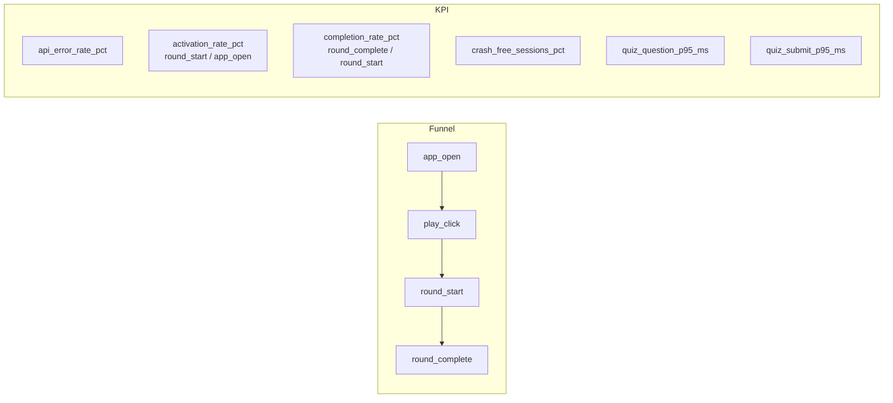
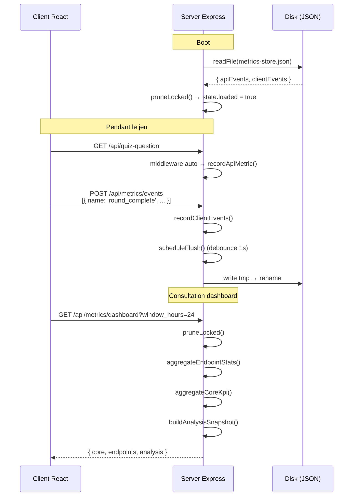

# Système de métriques

> Analytics first-party, sans tracker externe, pour piloter un quiz naturaliste à l'aveugle.

## Pourquoi un système first-party

iNaturaQuizz n'utilise **aucun tracker tiers** (pas de Google Analytics, pas de Mixpanel). Raisons :

1. **Respect de la vie privée** — pas de cookies, pas de fingerprinting, pas de données partagées avec des tiers
2. **Données pertinentes** — les trackers génériques ne capturent pas les métriques spécifiques au jeu (taux de réussite par pack, coût IA par session, rétention D7)
3. **Budget zéro** — un fichier JSON sur disque suffit pour un projet à trafic modéré

## Architecture

**Fichier** : `server/services/metricsStore.js` (830 lignes)



## Deux flux d'événements

### 1. API Events (auto-instrumentés)

Chaque requête `/api/*` (sauf `/api/metrics/events`) est automatiquement capturée par le middleware dans `server/app.js` :

```javascript
{
  ts: 1719000000000,
  method: "GET",
  path: "/api/quiz-question",   // normalisé (IDs → :id)
  status: 200,
  duration_ms: 42.3,
  tags: {
    pack_id: "common_european_mushrooms",
    game_mode: "easy",
    media_type: "photo",
    locale: "fr",
  }
}
```

**Normalisation du path** : les segments numériques ou hexadécimaux sont remplacés par `:id` pour l'agrégation (`/api/reports/abc123` → `/api/reports/:id`).

**Tags** : seules 5 clés sont autorisées (`pack_id`, `game_mode`, `media_type`, `locale`, `round_action`), chaque valeur tronquée à 80 caractères.

### 2. Client Events (envoyés par le frontend)

Le client envoie des événements via `POST /api/metrics/events` :

```javascript
{
  ts: 1719000000000,
  name: "round_complete",          // z.enum strict, 13 noms autorisés
  session_id: "sess-uuid-...",
  anon_user_id: "user-uuid-...",
  properties: {
    pack_id: "common_european_mushrooms",
    mode: "easy",
    success: true,
    player_level: 12,
    question_index: 5,
  }
}
```

**Types d'événements client** (13) :

| Événement | Quand |
|-----------|-------|
| `app_open` | Ouverture de l'app (avec UTM, referrer) |
| `play_click` | Clic sur "Jouer" |
| `round_start` | Début d'une partie |
| `question_view` | Affichage d'une question |
| `answer_submit` | Soumission d'une réponse |
| `round_complete` | Fin d'une partie (avec success, score) |
| `quit_mid_round` | Abandon en cours de partie |
| `explanation_open` | Ouverture d'une explication IA |
| `explanation_feedback` | Feedback sur l'explication (useful: true/false) |
| `report_submit` | Signalement d'un problème |
| `client_error` | Erreur JavaScript côté client |
| `api_error` | Erreur API observée côté client |
| `ai_usage` | Tokens IA consommés (prompt, output, coût) |

## Stockage et persistence

### Modèle mémoire

```javascript
const state = {
  loaded: false,
  apiEvents: [],       // max 200 000
  clientEvents: [],    // max 100 000
};
```

### Concurrence

Un verrou séquentiel (`runExclusive()`) garantit qu'une seule opération de lecture/écriture s'exécute à la fois. Ce n'est pas un mutex traditionnel — c'est un chaînage de promesses :

```javascript
function runExclusive(task) {
  const next = lock.then(task, task);
  lock = next.catch(() => {});
  return next;
}
```

### Persistence disque

- **Format** : JSON avec indentation (`JSON.stringify(..., null, 2)`)
- **Écriture atomique** : écriture dans un fichier `.tmp` puis `rename()` pour éviter la corruption
- **Debounce** : `scheduleFlush()` attend 1 seconde après le dernier événement avant d'écrire, pour battre les rafales
- **Timer unref** : `flushTimer.unref()` permet à Node.js de s'arrêter proprement sans attendre le timer

### Rétention et limites

| Paramètre | Défaut | Source |
|-----------|--------|--------|
| `metricsRetentionHours` | 24h (min) | env |
| `metricsMaxApiEvents` | 200 000 | env |
| `metricsMaxClientEvents` | 100 000 | env |

`pruneLocked()` supprime les événements plus vieux que la rétention et tronque les tableaux aux limites max.

## Dashboard — `getMetricsDashboard()`

Le dashboard est calculé **à la demande** (pas pré-agrégé). Il accepte un `windowHours` (1h à 14 jours) et retourne 3 blocs :

### 1. Core KPI



| KPI | Formule | Intérêt |
|-----|---------|---------|
| `api_error_rate_pct` | 500+ / total requests | Fiabilité serveur |
| `activation_rate_pct` | round_start / app_open | Conversion visiteur → joueur |
| `completion_rate_pct` | round_complete / round_start | Engagement |
| `report_success_rate_pct` | reports success / reports total | Qualité des signalements |
| `crash_free_sessions_pct` | (sessions - sessions avec erreur) / sessions | Stabilité client |
| `quiz_question_p95_ms` | P95 latence GET /api/quiz-question | Performance perçue |
| `quiz_submit_p95_ms` | P95 latence POST /api/quiz/submit | Performance perçue |

### 2. Endpoint Stats

Agrégation par endpoint (`METHOD path`) avec :
- `count` — nombre d'appels
- `error_count` / `error_rate_pct` — taux d'erreur 500+
- `p50_ms`, `p95_ms`, `p99_ms` — distribution de latence

### 3. Analysis Snapshot

10 analyses calculées à la demande :

#### Funnels

Activation (app_open → round_start) et Completion (round_start → round_complete).

#### Abandonment

Analyse des `quit_mid_round` :
- Question médiane d'abandon (`p50_question_index`)
- Distribution par mode de jeu et par pack

#### Pack Health

Par pack : round_start, round_complete, taux de complétion, accuracy, signalements, P95 quiz-question.

#### Difficulty Fairness

Taux de réussite croisé par :
- Mode de jeu (easy vs riddle vs hard)
- Mode × pack
- Tranche de niveau joueur (1-5, 6-10, 11-20, 21-30, 31+)

#### Explain Value

Métriques sur les explications IA : ouvertures, feedback useful/not_useful, taux d'utilité.

#### Reliability

- Top 20 erreurs API (par endpoint + status)
- Top 20 erreurs client (par source + code)
- Impact sur l'abandon : quit_rate_with_error vs quit_rate_without_error

#### Performance by Hour

Séries temporelles horaires : P95 quiz-question, round_start, round_complete, taux de complétion.

#### AI Cost

Suivi des tokens et coûts IA :
- Tokens prompt/output/total
- Coût estimé total / par explication / par session
- Ventilation par jour

#### Growth

Sources d'acquisition : `utm_source`, `utm_medium`, `utm_campaign`, `referrer_host`.

#### Retention

Rétention par cohorte :
- D1, D3, D7 (eligible_users, retained_users, retention_rate_pct)
- Basé sur le `firstOpenTs` de chaque `anon_user_id`

#### Feedback Quality

Signalements : total, succès, catégories, taux de correction.

## Flux complet



## Limites connues

| Limite | Conséquence | Mitigation |
|--------|-------------|------------|
| Tout en mémoire | 200K API events ≈ ~40 MB | Prune agressif, max events configurable |
| Fichier JSON | Pas de requêtes complexes | Suffisant pour un dev solo |
| Pas de sampling | Tous les événements sont stockés | Rétention courte (24h par défaut) |
| Single instance | Pas d'agrégation multi-serveur | Fly.io = 1 instance |
| Calcul on-demand | Dashboard lent avec 200K events | Fenêtre par défaut 24h |

---

*Fichier clé : [server/services/metricsStore.js](../../server/services/metricsStore.js)*
