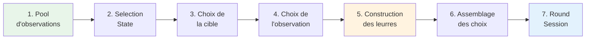
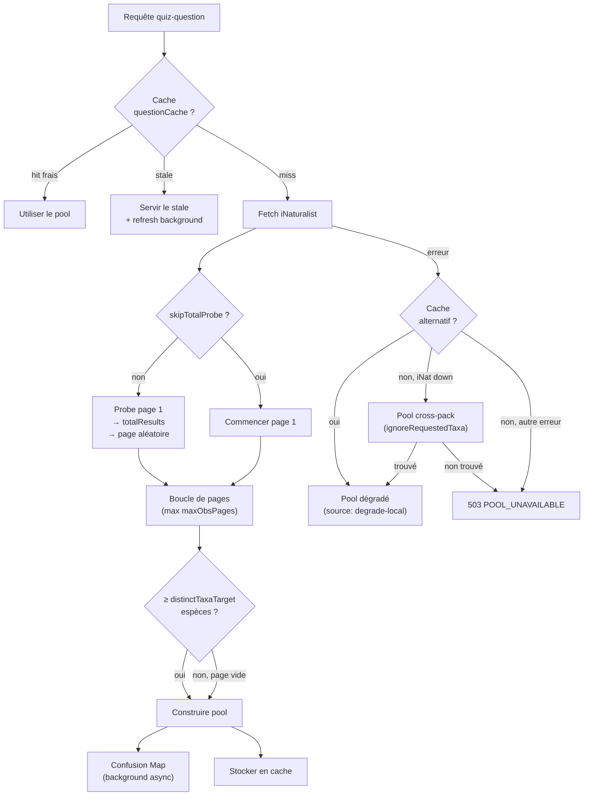
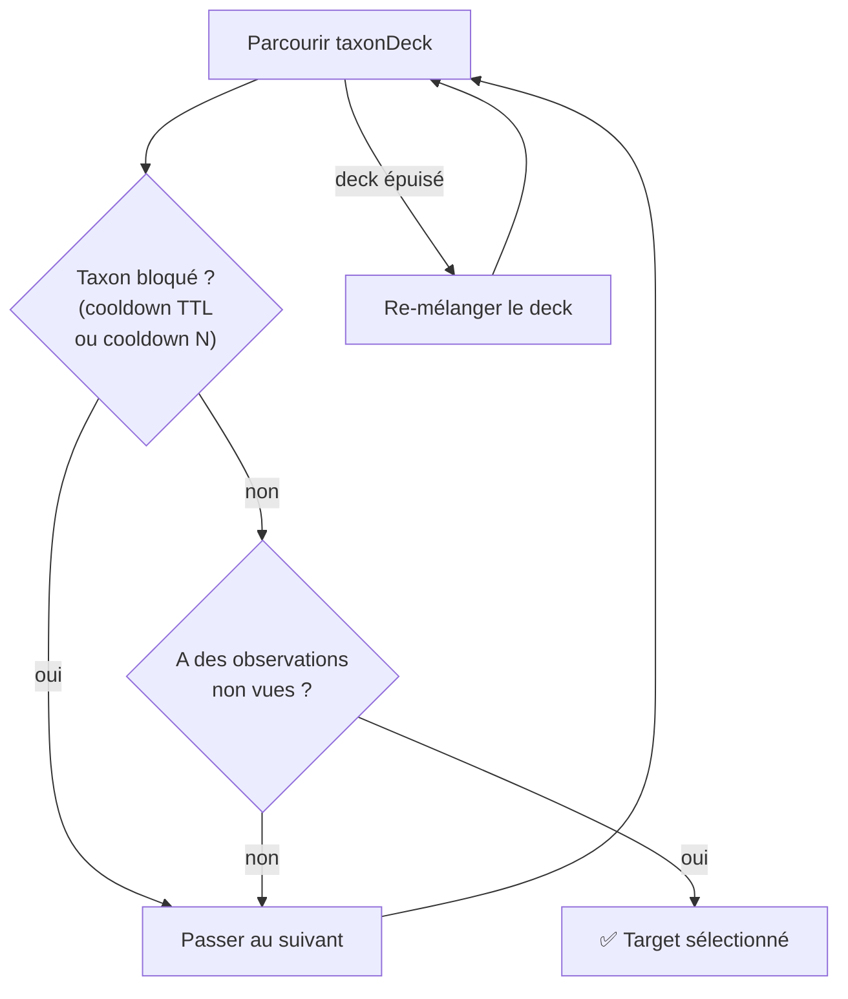
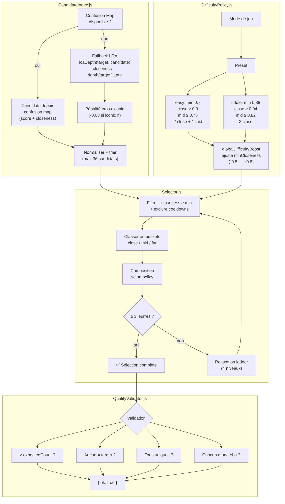
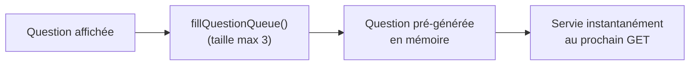

# Pipeline de génération de questions

> Comment une photo de champignon devient un QCM à 4 choix en ~200 ms.

## Vue d'ensemble du pipeline

Quand le client appelle `GET /api/quiz-question`, le serveur exécute un pipeline en 7 étapes pour construire une question unique, pertinente et non-répétitive.



## Étape 1 — Pool d'observations

**Fichier** : `server/services/observationPool.js`

Le pool est un ensemble d'observations iNaturalist correspondant aux critères du pack sélectionné (taxons, zone géographique, période).

### Cycle de vie du pool



### Structure du pool

```javascript
{
  timestamp: Date.now(),
  version: poolVersion,         // Date.now() normal, 1 pour seeded
  byTaxon: Map<taxonId, obs[]>, // observations groupées par espèce
  taxonList: string[],          // IDs des taxons disponibles
  taxonSet: Set<string>,        // pour lookups O(1)
  observationCount: number,     // total observations
  confusionMap: Map | null,     // espèces visuellement similaires
  source: 'inat' | 'degrade-local',
}
```

### Probe de pagination

Pour éviter de toujours montrer les mêmes observations (page 1), le serveur exécute une **probe initiale** : il demande 1 résultat pour obtenir `totalResults`, calcule le nombre de pages, et commence à une **page aléatoire** (capped à 10 maximum). Exception : les parties seedées (défi quotidien) commencent toujours page 1 pour que tous les joueurs aient les mêmes observations.

### Confusion Map

Après la construction du pool, une **confusion map** est bâtie en arrière-plan. Elle associe chaque taxon à ses espèces visuellement similaires (via `buildConfusionMap()`), ce qui permet au moteur de leurres de proposer des choix plus challengeants qu'un simple calcul de proximité taxonomique (LCA).

## Étape 2 — Selection State

**Fichier** : `server/services/selectionState.js`

L'état de sélection est **propre à chaque combinaison `(cacheKey, clientId)`**. Il mémorise ce que le joueur a déjà vu pour garantir la diversité.

### Composants de l'état

| Champ | Type | Rôle |
|-------|------|------|
| `recentTargetTaxa` | `string[]` | Taxons récemment utilisés comme cible (cooldown N) |
| `cooldownTarget` | `Map<id, expiry>` | Cooldown temporel TTL par taxon |
| `recentLureTaxa` | `string[]` | Taxons récemment utilisés comme leurre |
| `lureUsageCount` | `Map<id, count>` | Compteur d'usage pour pondération |
| `observationHistory` | `HistoryBuffer` | Buffer circulaire d'observations déjà montrées |
| `taxonDeck` | `string[]` | Deck mélangé (Fisher-Yates) de tous les taxons |
| `questionIndex` | `number` | Compteur incrémenté après chaque question |
| `version` | `number` | Lié au pool — reset si le pool change |

### Mécanisme du Deck

Plutôt que de piocher aléatoirement dans la liste de taxons (risque de répétition), le système utilise un **deck mélangé** : tous les taxons sont placés dans un tableau, mélangé via Fisher-Yates. Le système pioche séquentiellement dans le deck, en sautant les taxons bloqués par un cooldown. Quand le deck est épuisé, il est re-mélangé.

## Étape 3 — Choix de la cible

**Fichier** : `server/services/questionGenerator.js` → `buildQuizQuestion()`



Le système vérifie deux types de cooldown :
- **Cooldown temporel** (`cooldownTarget`, configurable via `COOLDOWN_TARGET_MS`) : le taxon ne peut pas réapparaître avant N millisecondes.
- **Cooldown par compteur** (`recentTargetTaxa`, taille `cooldownTargetN`) : fenêtre glissante des N derniers taxons ciblés.

### Accès concurrent — Mutex

Pour les parties normales (non-seedées), l'accès au `selectionState` est protégé par un **Mutex** (async-mutex). Cela empêche deux requêtes simultanées du même client de piocher le même taxon. Pour les parties seedées (défi quotidien), un état **éphémère** est créé à chaque requête — pas de mutex nécessaire car l'état n'est pas partagé.

## Étape 4 — Choix de l'observation

Parmi les observations du taxon cible, le système en choisit une **non encore vue** par ce client (via `observationHistory`). Si toutes ont été vues, il autorise un repassage (`allowSeen: true`).

## Étape 5 — Construction des leurres (Lures v2)

**Fichiers** : `server/services/lures-v2/`

Le moteur de leurres v2 est le composant le plus sophistiqué du pipeline. Il sélectionne 3 espèces plausiblement confondables avec la cible.



### Ladder de relaxation

Si le pool n'a pas assez de candidats proches, le Selector relâche progressivement les contraintes :

| Niveau | minCloseness drop | Threshold drop | Cross-iconic autorisé |
|--------|-------------------|----------------|-----------------------|
| 0 | 0.00 | 0.00 | Non |
| 1 | 0.05 | 0.03 | Non |
| 2 | 0.10 | 0.06 | Oui |
| 3 | 0.14 | 0.10 | Oui |

Si même le niveau 3 ne suffit pas, un **fallback** absolu prend les N meilleurs candidats par score, sans contrainte de closeness.

### Pondération par usage

La fonction `weightedPick()` dans le Selector pondère chaque candidat par `score / (usageCount + 1)`. Un leurre déjà montré 5 fois a 6× moins de chances d'être repris qu'un leurre jamais vu. Cela garantit la diversité sans cooldown rigide.

## Étape 6 — Assemblage des choix

Après la sélection de la cible + 3 leurres :

1. **Récupération des détails** — `getFullTaxaDetails()` enrichit chaque taxon (nom vernaculaire, rang, photo par défaut, statut de conservation). Mode `allowPartial: true` : pas bloquant si un taxon manque.
2. **Labels** — `makeChoiceLabels()` construit les étiquettes affichées (nom commun ou scientifique selon la locale).
3. **Shuffle** — `shuffleFisherYates()` mélange les 4 choix.
4. **Mode facile** — `buildUniqueEasyChoicePairs()` construit des paires simplifiées (labels dédupliqués).
5. **Contrat strict** — `assertStrictChoiceContract()` vérifie :
   - 4 taxon IDs uniques
   - 4 labels uniques
   - Exactement 1 réponse correcte
   - Si mode facile : IDs faciles ⊂ IDs normaux

### Modes de jeu spéciaux

| Mode | Spécificité pipeline |
|------|---------------------|
| **easy** | 4 choix photo, mode facile = labels simplifiés |
| **riddle** | Pas d'image, 3 indices générés par IA, 3 tentatives max |
| **hard** | Pas de leurres visibles, le joueur tape le nom, max N guesses |
| **taxonomic** | Pas de leurres classiques, ascension taxonomique (steps par rang) |

## Étape 7 — Round Session

Le pipeline se termine par la création d'une **round session** signée (voir [round-security.md](round-security.md)) qui encapsule la réponse correcte côté serveur. Le client reçoit les choix et la signature, mais **jamais la réponse correcte** avant soumission.

## Pré-génération (Queue)

Pour éviter la latence au clic "Question suivante", le serveur **pré-génère** la question suivante en arrière-plan :



La queue a une taille maximum de 3 questions pré-générées. `getQueueEntry()` vérifie que l'entrée n'est pas expirée et que la question n'est pas un doublon avant de la servir.

## Performance

Timings typiques (mesuré via `Server-Timing` header) :

| Phase | Durée typique |
|-------|---------------|
| Pool (cache hit) | 0 ms |
| Pool (fetch iNat) | 200–800 ms |
| Selection State | < 1 ms |
| Lures v2 | 1–5 ms |
| Taxa Details (cache) | 0–5 ms |
| Round Session | < 1 ms |
| **Total (cache hit)** | **10–50 ms** |
| **Total (cache miss)** | **300–1000 ms** |

---

*Fichiers clés : [server/services/questionGenerator.js](../../server/services/questionGenerator.js), [server/services/observationPool.js](../../server/services/observationPool.js), [server/services/selectionState.js](../../server/services/selectionState.js), [server/services/lures-v2/](../../server/services/lures-v2/)*
