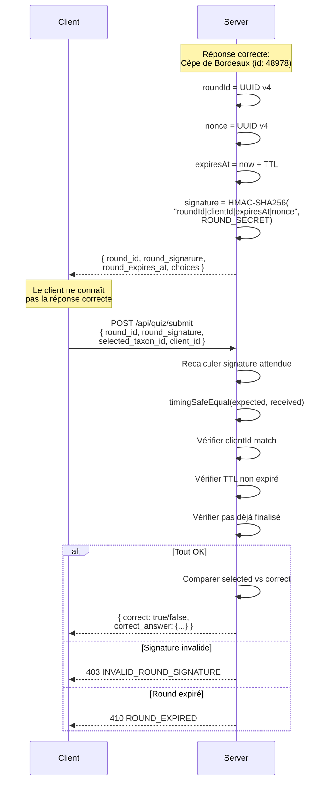
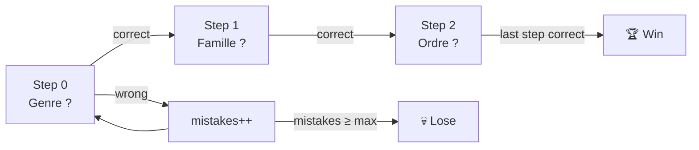

# Sécurité des rounds

> Comment le serveur garantit qu'un joueur ne peut pas tricher, même sans authentification.

## Le problème

iNaturaQuizz n'a **ni login, ni session, ni cookie**. Le `clientId` est un simple UUID généré côté navigateur. Pourtant, le serveur doit :

1. **Cacher la réponse correcte** jusqu'à la soumission
2. **Empêcher la modification** de la réponse après coup
3. **Empêcher la re-soumission** de la même réponse
4. **Limiter le temps** de réponse
5. **Gérer les modes multi-tentatives** (riddle: 3 essais, hard: N guesses, taxonomic: steps)

## Solution : Round signé HMAC-SHA256

Chaque question génère un **round** — un objet serveur temporaire protégé par une signature cryptographique.



## Anatomie d'un round

**Fichier** : `server/services/roundStore.js`

```javascript
{
  roundId:         "a1b2c3...",          // UUID v4
  clientId:        "x9y8z7...",          // UUID client
  locale:          "fr",
  gameMode:        "easy",               // easy | riddle | hard | taxonomic
  correctTaxonId:  "48978",
  correctAnswer:   { name, common_name, rank, ancestors, ... },
  inaturalistUrl:  "https://...",
  expiresAt:       1719000000000,        // Unix ms
  nonce:           "d4e5f6...",          // UUID v4 anti-replay
  finalized:       false,               // true après soumission acceptée
  attemptsUsed:    0,
  maxAttempts:     1,                    // 3 pour riddle
  hardState:       null | { maxGuesses, guessesUsed, basePoints },
  taxonomicState:  null | { steps[], currentStepIndex, mistakes, ... },
  lastResult:      null | { ... },       // dernier résultat (anti-double-submit)
  createdAt:       1718999700000,
}
```

## Signature HMAC

### Création

```javascript
function signRound({ roundId, clientId, expiresAt, nonce }) {
  const payload = `${roundId}|${clientId}|${expiresAt}|${nonce}`;
  return crypto
    .createHmac('sha256', ROUND_SECRET)
    .update(payload)
    .digest('hex');
}
```

Le **payload** concatène 4 champs séparés par `|`. La clé secrète `ROUND_SECRET` est une variable d'environnement. Par défaut en dev : une clé dérivée du timestamp de démarrage.

### Vérification (timing-safe)

```javascript
function safeEqualHex(a, b) {
  const bufA = Buffer.from(String(a || ''), 'hex');
  const bufB = Buffer.from(String(b || ''), 'hex');
  if (bufA.length !== bufB.length) return false;
  return crypto.timingSafeEqual(bufA, bufB);
}
```

`crypto.timingSafeEqual()` compare les buffers en temps constant, ce qui empêche les **timing attacks** — un attaquant ne peut pas deviner la signature correcte en mesurant le temps de réponse.

### Double vérification

La vérification combine deux contrôles :
1. **Signature HMAC** — recalculée à partir des données du round stocké
2. **Client ID** — le client qui soumet doit être celui qui a reçu la question

## Protection anti-double-soumission

Deux mécanismes complémentaires :

### 1. Flag `finalized`

Une fois qu'un round est finalisé (`finalized = true`), toute nouvelle soumission retourne le `lastResult` stocké sans re-traitement. Cela empêche de "rejouer" un round pour obtenir un score différent.

### 2. Cache de déduplication

```javascript
const submissionDedupCache = new SmartCache({ ... });
// clé = `${roundId}|${submissionId || action:taxonId:stepIndex}`
```

Le `submissionId` (fourni par le client) ou une clé dérivée de l'action est stocké dans un cache dédié. Si la même soumission arrive deux fois (réseau instable, double-clic), la deuxième requête retourne le résultat cached sans ré-exécuter la logique.

## TTL et expiration

| Paramètre | Valeur | Source |
|-----------|--------|--------|
| `ROUND_STATE_TTL_MS` | configurable (env) | Durée de vie d'un round |
| roundCache max | 1000+ | Nombre max de rounds en mémoire |

Les rounds expirés sont nettoyés par le `SmartCache` sous-jacent. Un round expiré retourne `410 ROUND_EXPIRED`.

## Gestion par mode de jeu

### Easy (1 tentative)

```
selected == correct → win (finalized)
selected != correct → lose (finalized)
```

### Riddle (3 tentatives)

```
correct → win (finalized)
wrong, attempts < 3 → retry (non finalisé, indices supplémentaires)
wrong, attempts == 3 → lose (finalized)
```

### Hard (N guesses)

Le serveur maintient un `hardState` :
- `maxGuesses` : nombre max de suppositions (configurable)
- `guessesUsed` : compteur incrémenté à chaque guess
- `basePoints` : points de base (décroissant avec les tentatives)

```
correct → win (finalized), score = basePoints * (1 - guessesUsed/maxGuesses)
wrong, guesses remaining > 0 → playing (non finalisé)
wrong, guesses remaining == 0 → lose (finalized)
```

### Taxonomic (ascension par rangs)

Le serveur maintient un `taxonomicState` avec des **steps** (genre → famille → ordre → ...) :



Fonctionnalités supplémentaires :
- **Hints** : le joueur peut consommer un hint (max configurable) qui auto-résout le step courant
- **Score par rang** : chaque rang rapporte un nombre de points différent (`scorePerRank`)
- **Synchronisation** : le server vérifie que `stepIndex` du client correspond au `currentStepIndex` serveur (409 si désynchronisé)

## Balance tracking

Après chaque round résolu, `trackRoundOutcome()` enregistre le résultat dans un système de balance :

```javascript
pushBalanceEvent({
  gameMode, isCorrect, taxonId, iconicTaxonId, timestamp
})
```

Ces événements alimentent `getBalanceDashboardSnapshot()` qui calcule :
- Précision globale par fenêtre temporelle
- Précision par mode de jeu
- Distribution par groupe iconique (Aves, Fungi, Insecta...)

## Modes archivés

Les modes `riddle` et `taxonomic` peuvent être archivés via `ARCHIVED_GAME_MODES`. Toute tentative de créer ou soumettre un round avec un mode archivé retourne **HTTP 410** avec le code `MODE_ARCHIVED`.

## Résumé des protections

| Menace | Protection |
|--------|------------|
| Lire la réponse dans le réseau | Réponse correcte jamais envoyée avant soumission |
| Forger une soumission | Signature HMAC-SHA256 avec nonce |
| Timing attack sur la signature | `crypto.timingSafeEqual()` |
| Rejouer un round fini | Flag `finalized` + `lastResult` |
| Double-clic / réseau instable | `submissionDedupCache` |
| Prendre trop de temps | TTL sur le round → 410 |
| Changer de clientId | Vérification `clientId` dans la signature |
| Utiliser un mode désactivé | `ARCHIVED_GAME_MODES` → 410 |

---

*Fichier clé : [server/services/roundStore.js](../../server/services/roundStore.js)*
