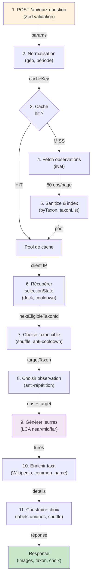
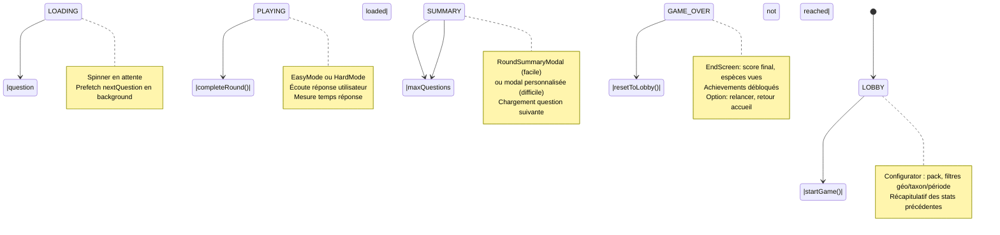
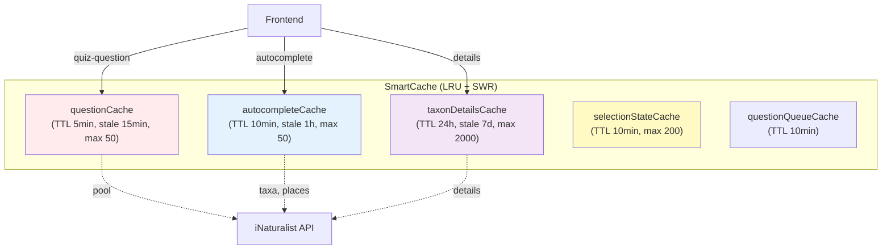
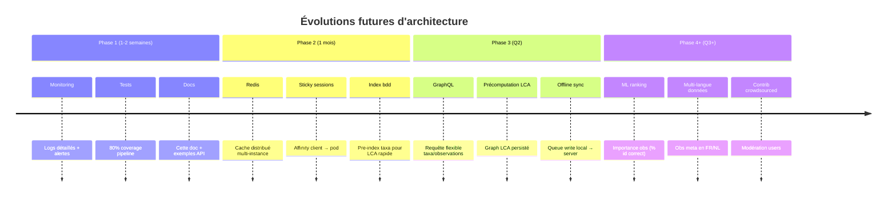

# 🏛️ Architecture – Vue d'ensemble unifiée

Ce document fusionne les architectures **Frontend** et **Backend** avec diagrammes et flux détaillés.

## 📋 Table des matières

1. [Concepts clés](#concepts-clés)
2. [Pipeline question (Backend)](#pipeline-question-backend)
3. [State machine (Frontend)](#state-machine-frontend)
4. [Stratégie cache](#stratégie-cache)
5. [Observabilité & Debug](#observabilité--debug)
6. [Limites et améliorations](#limites-et-améliorations)

---

## 🎯 Concepts clés

### Phylogénie et LCA (Lowest Common Ancestor)

**Concept** : Dans la classification taxonomique, le LCA entre deux espèces est l'ancêtre taxonomique le plus proche qu'elles partagent.

**Exemple** :
- Homme et Chimpanzé → LCA = Ordre Primates (profondeur 0.95)
- Homme et Baleine → LCA = Classe Mammalia (profondeur 0.70)
- Homme et Poisson → LCA = Embranchement Chordata (profondeur 0.40)

**Usage dans Inaturamouche** : Sélectionner des leurres qui sont **vrai ement crédibles** (même genre/famille) ou **progressivement plus difficiles** (ordres/classes différentes). Buckets :
- **near** (≥0.85) : Même genre/famille (très crédible)
- **mid** (≥0.65) : Même ordre/classe (moyennement difficile)
- **far** (<0.65) : Embranchements différents (diversité assurée)

---

## 🔄 Pipeline question (Backend)

### Vue globale



### Détail des étapes

#### **Étape 1-2 : Validation et normalisation**

```javascript
// Zod validation
const quizSchema = z.object({
  pack: z.string().optional(),                 // 'common_european_mushrooms', ...
  taxon_ids: z.array(z.coerce.number()).optional(),
  place_id: z.coerce.number().optional(),      // iNat place
  bbox: z.string().optional(),                 // "min_lon,min_lat,max_lon,max_lat"
  taxon_month_window: z.string().optional(),   // "10-03" (Oct→Mar, peut chevaucher)
  locale: z.enum(['en', 'fr', 'nl']),
  lure_count: z.coerce.number().default(4),
});

// Normalisation géo/période
// → geoParams: { place_id } ou { bbox } ou { mode: 'global' }
// → monthFilter: { months_array } ou { month_window }
```

#### **Étape 3-5 : Cache et fetch iNat**

```javascript
const cacheKey = buildCacheKey(geoParams, monthFilter);
// Format: "geo=place_1234|month=10,11,12|version=timestamp"

const cached = questionCache.get(cacheKey);
if (!cached || cached.isExpired()) {
  // Fetch observations
  const observations = await fetchObservationsChunked(cacheKey, {
    maxPages: MAX_OBS_PAGES,      // 10 pages
    pageSize: 80,
    targetDistinctTaxa: DISTINCT_TAXA_TARGET  // ~100 taxons
  });
  
  // Sanitize: garder que photos + ancêtres
  const { byTaxon, taxonList, version } = sanitizeObservations(observations);
  
  // Store dans LRU avec TTL 5 min, stale 15 min
  questionCache.set(cacheKey, { byTaxon, taxonList, version }, {
    ttl: 5 * 60 * 1000,
    staleTtl: 15 * 60 * 1000
  });
}

const pool = cached || fetched;
```

#### **Étape 6-7 : Sélection taxon cible (sans remise)**

```javascript
// Deck mélangé par client
const cacheKey_selection = `${cacheKey}|${clientIp}`;
let selectionState = selectionStateCache.get(cacheKey_selection);
if (!selectionState) {
  selectionState = {
    taxonDeck: shuffle(pool.taxonList),       // Fisher-Yates
    deckCursor: 0,
    recentTargetTaxa: new Set(),              // 10 derniers
    recentObsSet: new Set(),                  // 50 derniers obs IDs
    cooldownExpiry: null,
  };
}

// Choisir taxon éligible
const targetTaxonId = nextEligibleTaxonId(pool, selectionState, Date.now());
// → Pioche dans le deck sans remise
// → Saute taxons bloqués par cooldown
// → Vérifie qu'il reste ≥1 observation pour ce taxon
// → Fallback relaxed si tout épuisé
```

#### **Étape 8-9 : Observation cible + Leurres LCA**

```javascript
// Observation cible
const targetObs = pickObservationForTaxon(pool, targetTaxonId, selectionState);
// → Préfère obs jamais servies (recentObsSet)
// → Remembre l'obs ID

// Leurres par profondeur LCA
const lures = buildLures(pool, selectionState, targetTaxonId, targetObs, LURE_COUNT=4);
/*
  Algorithme :
  1. Pour chaque leurre potentiel :
     - Calculer LCA profondeur avec targetTaxon
     - Classer dans bucket : near (≥0.85) | mid (≥0.65) | far
  2. Au minimum 1 leurre par bucket (si disponible)
  3. Remplir le reste en respectant unicité + obs disponibilité
  4. Retour : [{ taxonId, obs }, ...] + comptage buckets
*/
```

#### **Étape 10-11 : Enrichissement et choix**

```javascript
// Récupérer détails iNat (wiki_url, common names)
const taxaDetails = await getFullTaxaDetails(
  [targetTaxonId, ...lures.map(l => l.taxonId)],
  locale
);

// Construire choix avec libellés uniques
const choices = makeChoiceLabels(taxaDetails, locale);
// Format: [
//   { taxonId, label: "Amanita muscaria (Agaricale)", difficulty: 'easy|hard' },
//   ...
// ]

// Mélanger les choix
const mixedChoices = shuffle(choices);
const correctIndex = mixedChoices.findIndex(c => c.taxonId === targetTaxonId);

// Mode facile : même taxonomie, labels simplifiés
const easyChoices = deriveEasyMode(mixedChoices);
```

#### **Réponse finale**

```javascript
return {
  id: generateId(),
  images: targetObs.photos.map(p => ({
    url: p.url,
    license: p.license,
    photographer: p.photographer,
    taxon_geoprivacy: p.taxon_geoprivacy
  })),
  taxon: {
    id: targetTaxonId,
    name: taxaDetails[targetTaxonId].name,
    common_name: taxaDetails[targetTaxonId].preferred_common_name,
    ancestors: taxaDetails[targetTaxonId].ancestors,  // [Kingdom, ..., Species]
    wikipedia_url: taxaDetails[targetTaxonId].wikipedia_url,
    inaturalist_url: `https://www.inaturalist.org/taxa/${targetTaxonId}`
  },
  choices: mixedChoices,
  easyChoices: easyChoices,
  correctIndex: correctIndex,
  
  // Debug headers (voir Observabilité)
  _debug: {
    buckets: { near: 2, mid: 1, far: 1 },
    poolSize: pool.taxonList.length,
    poolObs: pool.observations.length
  }
};
```

---

## 🎮 State machine (Frontend)

### Étapes du jeu (GameContext)



### Contexte réactif

```javascript
// GameContext.jsx
export const GameContext = createContext({
  // État général
  isGameActive: false,
  isGameOver: false,
  gameMode: 'easy',              // 'easy' | 'hard'
  
  // Questions
  question: null,                // { id, images, taxon, choices, ... }
  nextQuestion: null,            // Préchargée en background
  questionCount: 1,
  
  // Scoring
  score: 0,
  streak: 0,
  roundResults: [],              // { taxonId, correct, timeMs, biomes, ... }
  
  // Flags
  canStartReview: false,         // ∃ taxons manqués ?
  reviewTaxonIds: [],            // Pour filtrer la prochaine partie
  
  // Erreurs
  error: null,                   // { code, message }
  
  // Actions
  startGame: async (params) => { ... },
  completeRound: async (result) => { ... },
  prefetchNextQuestion: async () => { ... },
  resetToLobby: () => { ... },
  finalizeGame: () => { ... }
});
```

### Lifecycle (exemple partie)

```
User clique "Commencer"
│
├─> startGame({ pack: 'mushrooms', place_id: 123 })
│   ├─> isGameActive = true
│   ├─> questionCount = 1
│   ├─> POST /api/quiz-question (main)
│   ├─> prefetch POST /api/quiz-question (nextQuestion)
│   └─> State: PLAYING (question prête)
│
├─> USER ANSWERS → completeRound({ correct: true, timeMs: 8500 })
│   ├─> calcScore() : +10 pts, streak +1
│   ├─> recordRound({ taxonId, correct, biomes, time })
│   ├─> updateUserContext (scores, achievements)
│   └─> State: SUMMARY (modal recap + nextQuestion déjà chargée)
│
├─> USER CLICK "Continuer"
│   ├─> question = nextQuestion
│   ├─> prefetch nouvelle question
│   ├─> questionCount ++
│   └─> State: PLAYING
│
└─> (répéter ou maxQuestions atteint)
    └─> finalizeGame()
        ├─> isGameOver = true
        ├─> nextQuestion = null
        └─> redirect /end
```

### Annulation de requêtes (AbortController)

```javascript
// Évite les "requêtes orphelines"

let abortController = new AbortController();
let prefetchAbortController = new AbortController();

async function fetchQuestion() {
  try {
    const response = await fetch('/api/quiz-question', {
      signal: abortController.signal
    });
    setQuestion(response);
  } catch (e) {
    if (e.name === 'AbortError') {
      // Ignoré (user a quitté, restart, etc.)
    } else {
      setError(e);
    }
  }
}

// Si user restart ou navigue
function resetToLobby() {
  abortController.abort();           // Annule requête main
  prefetchAbortController.abort();   // Annule prefetch
  // Re-créer nouveaux controllers
  abortController = new AbortController();
  prefetchAbortController = new AbortController();
}
```

---

## 💾 Stratégie cache

### SmartCache : Architecture et politique



### Détail par cache

| Cache | TTL | Stale | Max | Usage | Clé |
|-------|-----|-------|-----|-------|-----|
| **questionCache** | 5m | 15m | 50 | Pool observations | `geo=*\|month=*` |
| **autocompleteCache** | 10m | 1h | 50 | Taxa/places auto | `taxa:query` |
| **taxonDetailsCache** | 24h | 7d | 2000 | Wiki, common names | `taxon:${id}:${locale}` |
| **selectionStateCache** | 10m | — | 200 | Deck, cooldown, history | `${cacheKey}\|${clientIp}` |
| **questionQueueCache** | 10m | — | — | Prefetch queue (client) | `queue:${sessionId}` |

### Cache policies (Frontend PWA)

```javascript
// vite.config.js : Vite PWA plugin config

const workboxConfig = {
  // Quiz : toujours frais (évite doublons dues cooldown)
  runtimeCaching: [
    {
      urlPattern: /^https:\/\/.*\/api\/quiz-question/,
      handler: 'NetworkOnly',
      options: { networkTimeoutSeconds: 10 }
    },
    
    // Autocomplete : favorise cache (SWR)
    {
      urlPattern: /^https:\/\/.*\/(api\/taxa\/autocomplete|api\/observations\/species_counts)/,
      handler: 'StaleWhileRevalidate',
      options: {
        cacheName: 'api-metadata',
        expiration: { maxEntries: 50, maxAgeSeconds: 3600 }
      }
    },
    
    // Photos iNaturalist : cache long terme
    {
      urlPattern: /^https:\/\/(static\.inaturalist\.org|s3.*)/,
      handler: 'CacheFirst',
      options: {
        cacheName: 'inaturalist-photos',
        expiration: { maxEntries: 400, maxAgeSeconds: 7 * 24 * 3600 }
      }
    }
  ]
};
```

### Circuit Breaker et fallback

```javascript
// Si iNat API down → basculer sur packs locaux

const MAX_INATURALIST_FAILURES = 3;
let inaturalistFailureCount = 0;

async function fetchWithCircuitBreaker(url, params) {
  if (inaturalistFailureCount >= MAX_INATURALIST_FAILURES) {
    // Circuit ouvert : utiliser packs locaux
    console.warn('Circuit breaker ouvert → packs locaux');
    return loadLocalPack(params.pack);
  }
  
  try {
    const result = await fetchJSON(url, params);
    inaturalistFailureCount = 0;  // Reset
    return result;
  } catch (error) {
    inaturalistFailureCount++;
    if (inaturalistFailureCount >= MAX_INATURALIST_FAILURES) {
      // Bascule graduelle
      console.error('Basculage en mode local après', inaturalistFailureCount, 'erreurs');
    }
    throw error;
  }
}
```

### Limitations actuelles et solutions futures

| Limitation | Impact | Solution |
|-----------|--------|----------|
| **Pas de persistance** | Cache perdu au redémarrage | Redis, Memcached, DynamoDB |
| **Pas de distribution** | Un client par instance | Sticky sessions OU Redis partagé |
| **TTL fixe** | Peut desservir (data périmée) ou excéder capacity | TTL adaptatif basé utilisation |
| **Anti-répétition local** | Doublons possibles multi-tab | Clé de session, IndexedDB partagée |

---

## 🔍 Observabilité & Debug

### Headers de réponse

```http
HTTP/1.1 200 OK
Server-Timing: fetchObs;dur=150, buildIndex;dur=45, pickTarget;dur=12, buildLures;dur=78, taxa;dur=120, labels;dur=25, total;dur=430
X-Cache-Key: geo=place_1234|month=10,11,12|version=1705340400000
X-Selection-Geo: place_id
X-Lure-Buckets: near=2, mid=1, far=1
X-Pool-Pages: 5
X-Pool-Obs: 400
X-Pool-Taxa: 87
X-Lures-Relaxed: false
X-Request-Id: req-abc123xyz789
Content-Type: application/json
```

### Interpréter les headers

| Header | Signification | Action si problème |
|--------|---------------|-------------------|
| `Server-Timing` | Étapes du pipeline en ms | Repérer goulot (ex: fetchObs long) |
| `X-Cache-Key` | Pool utilisé | Vérifier si normalisation OK |
| `X-Lure-Buckets` | Distribution LCA | near=0 → manque diversité |
| `X-Pool-Obs` | Données iNat | <50 → peu de choix, cache vide ? |
| `X-Lures-Relaxed` | Fallback activé | Pool épuisé, cooldown trop strict |

### DevTools + Server-Timing

Depuis Chrome/Firefox, ouvrir DevTools → Network → quiz-question :
- Onglet **Timing** : graphique du Server-Timing
- Voir chaque étape (fetch, build, select) en ms
- Identifier goulots (ex: iNat lent, LCA calcul lourd)

### Logs Pino (server)

```bash
# Logs JSON structurés
npm run dev 2>&1 | grep "quiz-question"

# Exemple log
{
  "level": 30,
  "time": 1705340400000,
  "msg": "GET /api/quiz-question",
  "req": { "id": "req-123", "method": "GET", "url": "/api/quiz-question?pack=..." },
  "res": { "statusCode": 200, "responseTime": 430 },
  "cache": { "hit": false, "cacheKey": "geo=place_1234|..." },
  "lures": { "buckets": { "near": 2, "mid": 1, "far": 1 }, "relaxed": false }
}
```

---

## ⚙️ Limites et améliorations

### Problèmes actuels

| Problème | Cause | Priorité |
|----------|-------|----------|
| **Pas de scaling** | Cache en mémoire local | HIGH (pour >100 users) |
| **Anti-répétition naïf** | Historique court (50 obs) | MEDIUM (plus long TTL) |
| **Cooldown strict** | Peut bloquer tout le deck | MEDIUM (adaptatif) |
| **Pas d'update cache en temps réel** | iNat données figées 5min | LOW (acceptable) |
| **Observations orphelines** | Si obs supprimée iNat | MEDIUM (retry) |

### Roadmap améliorations



---

## 📚 Ressources complémentaires

- **[QUIZ_PIPELINE.md](./guides/backend/QUIZ_PIPELINE.md)** : Détail algorithmique, examples codebase
- **[CACHE_STRATEGY.md](./guides/backend/CACHE_STRATEGY.md)** : TTL, SWR, Redis planning
- **[GAME_STATE.md](./guides/frontend/GAME_STATE.md)** : GameContext API, hooks
- **[PWA_OFFLINE.md](./guides/frontend/PWA_OFFLINE.md)** : Service Worker, offline-first
- **[API_REFERENCE.md](./API_REFERENCE.md)** : Contrats routes, exemples cURL
